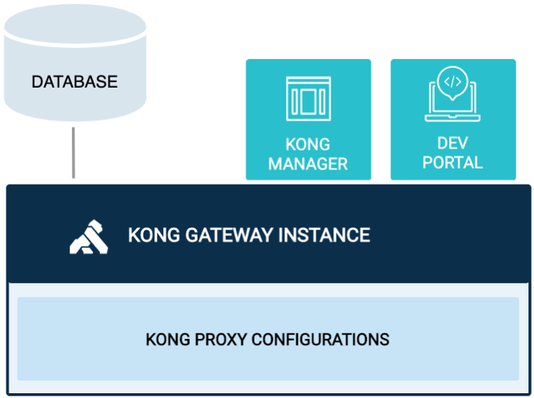
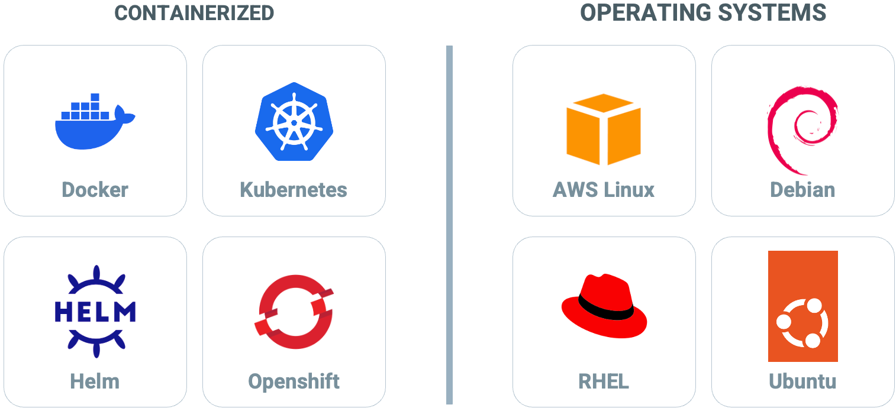

# Installation Overview

<!-- .slide: class="page-title" -->

## Component Parts - What needs to be Installed?

<figure style="display: block; float: right; width: 50%; margin: 0 10px;">
    
</figure>

There are a number of key components to the Kong Gateway infrastructure
 - **Kong Gateway** - Brokers API requests across all upstream services
 - **Kong Manager** - Browser-based UI for monitoring and managing Kong Gateway
 - **Kong Developer Portal** - Build a service catalog to simplify discovery & re-use of APIs

These are logical components and part of the same binary.  Additionally in most installations a database is also required
 - Database - Stores configured entities such as Routes, Services, and Plugins. Kong supports the PostgreSQL

## Kong Gateway: Installation Options

<figure style="display: block; margin: 0 auto; width: 90%;">
    
</figure>

## Kong Gateway Container Images 

Kong Gateway provides slim and UBI images:
 - Universal Base Image (UBI) - OCI-compliant container base operating system images with complementary runtime languages and packages that are freely redistributable
 - Slim Images - only contain software required to run the Gateway.
   - This ensures that false positive vulnerabilities aren't flagged during security scanning
   - Any vulnerabilities detected in supported images will be addressed in the next available patch release.

**If you require other dependencies, you can build custom Kong Docker images - see docs for details
**