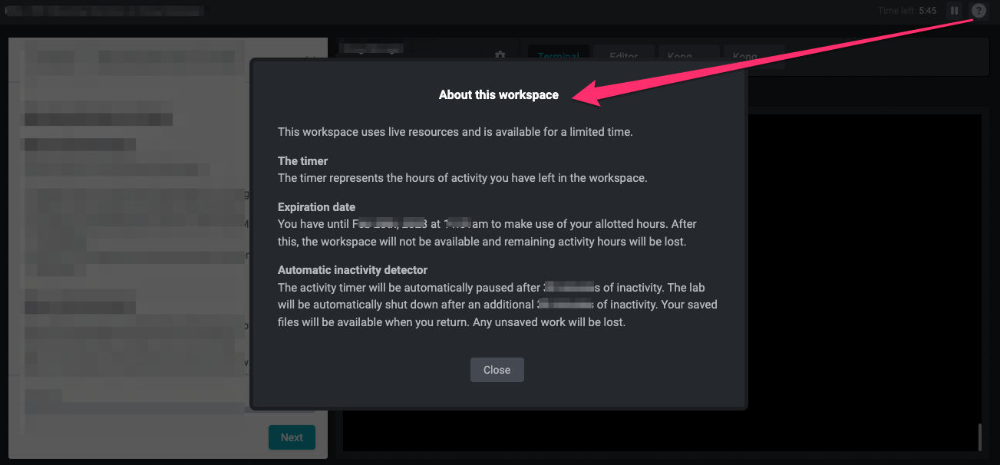

# Kong Gateway Installation Introduction

<!-- .slide: class="page-title" -->


## Introduction

The purpose of this lab is to give you practical experience of installing the Kong Gateway. 
 
Kong can be installed on many types of platform, and each has its own set of requirements. For the purposes of this course we will be installing it using Docker Compose.

The steps we will go through are as follows:

```bash
$ PWD
/tmp
```


## Agenda

<!-- .slide: id="master-toc" class="toc" -->

<!-- - [Chapter 1](#/1) -->
- [View Docker Compose and SSL Configuration](#/1)
- [Start the Kong containers](#/2)
- [Upload a license](#/3)
- [Save/Load a configuration](#/4)
- [Configure Developer Portal](#/5)


## Course Legend

In this course, commands intended for typing into the terminal are formatted in red text and the expected response is in white, for example

```shell
pwd
```
```
/home/ubuntu
```

<!-- # Setup Lab Environment

Run the following command to start your lab.

```shell
source ./start_lab.sh
```

**Please note** you may need to wait for up to a minute before the system is available.

Also note that Kong Gateway is launched as part of this lab, therefore Kong Manager and Kong Developer Portal won't display in the tab on the right until the Gateway is running.

This workspace uses live resources and is available for a limited time.  For details of how long its available for, and how long is left, please click on the question mark ('?') at the top right of the screen.



If you have difficulties with this lab, then please email **`learn@konghq.com`**. -->