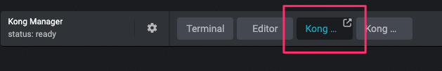

# Start the Kong containers

We are now ready to start the containers to deploy Kong.

We will perform the following specific tasks:
1. Bring up Kong Gateway
2. Verify Admin API
3. Verify Kong Manager

## Task 1: Bring up Kong Gateway

Make sure you're in the `installation` directory and run `docker-compose up -d`.

```shell
docker compose up -d
```
```
[+] Running 13/13
 ⠿ Container grafana             Removed               0.7s
 ⠿ Network kong-edu-net          Created               0.1s
 ⠿ Container keycloak            Started               1.8s
 ⠿ Container redis               Started               2.0s
 ⠿ Container postgres            Started               1.6s
 ⠿ Container smtp                Started               2.0s
 ⠿ Container prometheus          Started               1.8s
 ⠿ Container mockbin             Started               1.8s
 ...
 ```

## Task 2: Verify Admin API

In our lab environment we can access our Kong Admin API on localhost:8001

```shell
http --headers GET localhost:8001
```
```
HTTP/1.1 200 OK
Access-Control-Allow-Credentials: true
Access-Control-Allow-Origin: https://4nabxokzcbm86e7we-63dd1a5a73e7d652becc1152.labs.kongedu.io:8445
Connection: keep-alive
Content-Length: 22446
Content-Type: application/json; charset=utf-8
Date: Sun, 26 Mar 2023 12:25:45 GMT
Server: kong/3.2.2.0-enterprise-edition
X-Kong-Admin-Latency: 301
X-Kong-Admin-Request-ID: 0KiW9ORafTQls4fu91XloASMmQC3kpT9
vary: Origin
```

## Task 3: Verify Kong Manager

Click on 'Kong Manager' at top of the screen 



<!-- If you wish you can pop this out to a new tab.

Or click [here](http://{{ .STRIGO_RESOURCE_DNS }}:8002) -->


Please note, you may need to click the refresh button.


You'll notice you did not need to log into Kong Manager - that's because RBAC Authentication has not yet been enabled. 

You'll also notice the warning about the license - we will apply the licence next.
