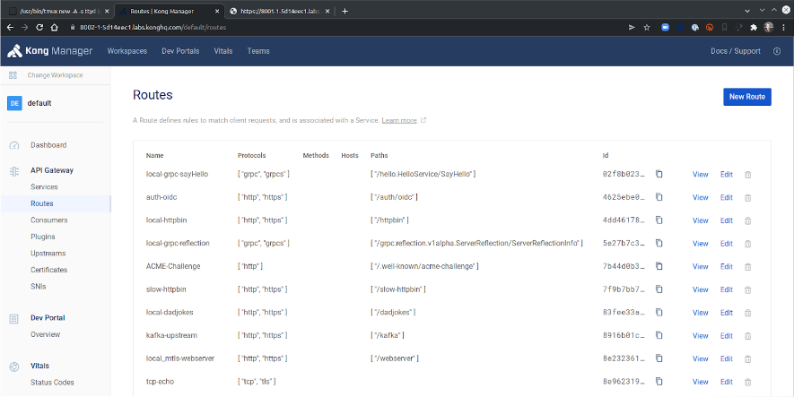

# Load a Sample Configuration

 ## What is decK?

decK is a command line tool for declaratively managing Kong's configuration:

* No need to run individual API commands to Kong's admin endpoint -just define Kong's desired state in a YAML file, covering services/routes/plugins/etc., and let decK Sync configuration to Kong.
* Configuration can be maintained in GitHub, fostering team collaboration and distributed workflows.
* decK can also run diffs to detect any drift or changes and can back up your instance's configuration.
* decK's state file can contain sensitive data such as private keys of certificates, credentials, etc. It is up to the user to manage and store the state file in a secure fashion.

We will perform the following specific tasks:
1. Verify decK and Create a sample Service/Route
2. Load Kong Configuration using decK
3. Sync updates and view config in Kong Manager
4. View created entities in Kong Manager
5. Restore Kong Configuration using decK
6. Confirm Service Restoration

## Task 1: Verify decK and Create a sample Service/Route

Let's create a sample service/route that we could use deck to save, delete and restore.

```shell
deck gateway ping
```
```
Successfully connected to Kong!
Kong version:  3.2.2.0
```

Next we will create a simple service and route:

```shell
http POST localhost:8001/services \
    name=mockbin_service \
    url=http://mockbin:8080
```

```shell
http -f POST localhost:8001/services/mockbin_service/routes \
    name=mockbin_route \
    paths=/mock
```

## Task 2: Load Kong Configuration using decK

Backup current configuration to a YAML file we can review/restore.

```shell
deck gateway dump --output-file labdump.yaml --workspace default
```

Use decK to compare the state file with the active configuration:.

```shell
deck gateway diff labdump.yaml
```
```
Summary:
  Created: 0
  Updated: 0
  Deleted: 0
```

Delete current configuration, resetting to default.

```shell
deck gateway reset
```
```
This will delete all configuration from Kong's database.
> Are you sure? Y
deleting route mockbin_route
deleting service mockbin_service
Summary:
  Created: 0
  Updated: 0
  Deleted: 2
```

Verify there is no configuration, either in Kong Manager or using Kong Admin API

```shell
http -b localhost:8001/services
```
```
{
    "data": [],
    "next": null
}
```
```shell
http -b localhost:8001/routes
```
```
{
    "data": [],
    "next": null
}
```

Restore backup to active configuration

```shell
deck gateway sync labdump.yaml
```
```
creating service mockbin_service
creating route mockbin_route
Summary:
  Created: 2
  Updated: 0
  Deleted: 0
```


## Task 3: Sync updates and view config in Kong Manager

We can use `deck diff` to compare active configuration to another saved state, and `deck sync` to upload the reviewed saved configuration to Kong.
 
```shell
deck gateway diff sampledump.yaml --workspace default
```
```shell
deck gateway sync sampledump.yaml --workspace default
```

```
...
creating plugin udp-log for route f491db3f-7018-4197-ae6e-42f69202d6e1
creating plugin rate-limiting-advanced for route d86e9f0c-e2bc-470d-a5a9-8f523512f379
creating plugin acme (global)
creating plugin openid-connect for route 4625ebe0-8287-44a2-8cc0-27a182e5a06d 
deleting route mockbin
deleting service mockbin
Summary:
  Created: 56
  Updated: 0
  Deleted: 2
```

## Task 4: View created entities in Kong Manager

You can use Kong Manager to review new entities that were created using the sync operation. 




## Task 5: Restore Kong Configuration using decK

Now we can restore Kong configuration from the YAML file we created earlier:

```shell
cat labdump.yaml
```

```shell
deck gateway sync labdump.yaml --workspace default
```
```
...
deleting ca_certificate fa6e9989-86cb-4b26-bedd-b5f2f1af7f76
deleting certificate f28adba8-8a29-4f04-8cc1-0646746ac48a
deleting certificate 507cc555-5b92-496d-9e89-bfc78dfcddbe
deleting certificate f3ae1bb2-ea6a-4caf-a7a7-2f078b7842db
Summary:
  Created: 2
  Updated: 0
  Deleted: 56
```


## Task 6: Confirm Service Restoration

Now you can review the service/route in the Kong Manger to confirm it is restored. That could also be achieved through the Admin API. Once done, let us create a request to observe functionality.

```shell
http GET localhost:8001/services
```
```shell
http GET localhost:8001/routes
```

```shell
http GET localhost:8000/mock
```
```shell
http --verify no GET https://localhost:8443/mock
```

```
HTTP/1.1 200 OK
Access-Control-Allow-Credentials: true
Access-Control-Allow-Headers: host,connection,x-forwarded-for,x-forwarded-proto,x-forwarded-host,x-forwarded-port,x-forwarded-path,x-forwarded-prefix,x-real-ip,user-agent,accept-encoding,accept
Access-Control-Allow-Methods: GET
Access-Control-Allow-Origin: *
Connection: keep-alive
Content-Length: 766
Content-Type: application/json; charset=utf-8
Date: Wed, 22 Feb 2023 14:29:16 GMT
ETag: W/"2fe-PDIcioXD8m8lHz5polnwqA"
Vary: Accept, Accept-Encoding
Via: kong/3.1.1.3-enterprise-edition
X-Kong-Proxy-Latency: 3
X-Kong-Upstream-Latency: 2
X-Powered-By: mockbin
...
```
